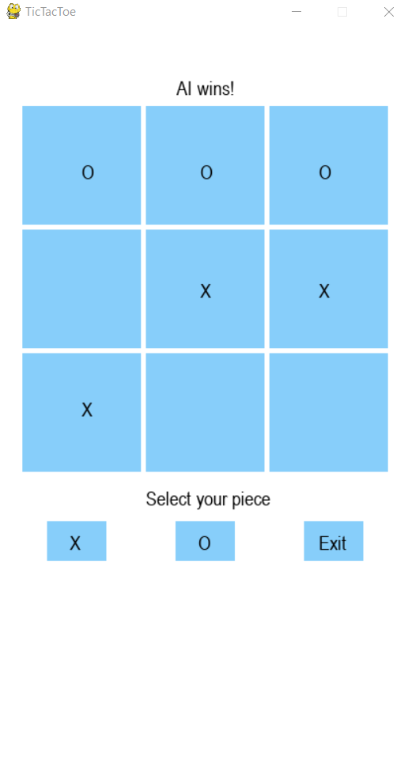
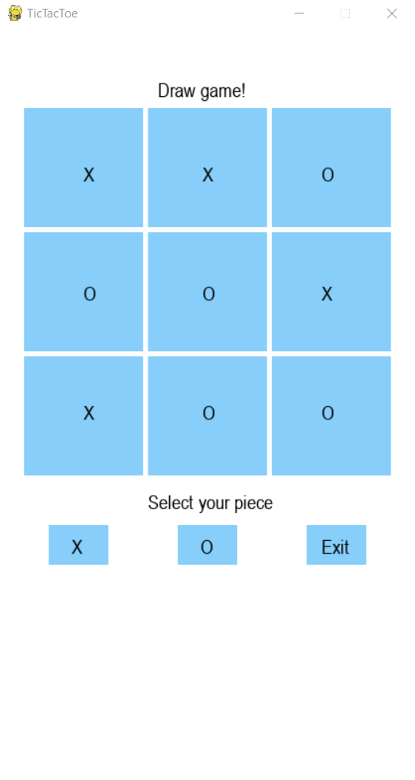
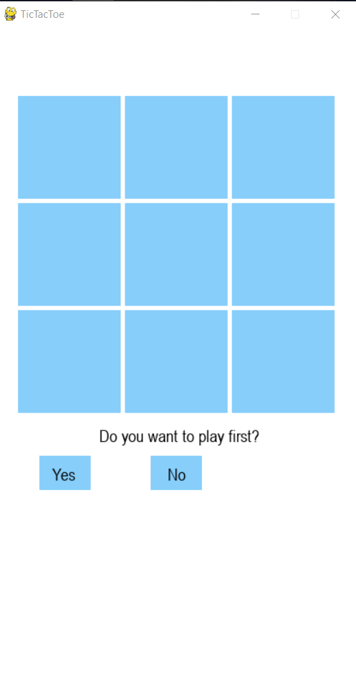

# Tic-Tac-Toe Game with an AI Agent Implemented using Min-Max Algorithm
### Bitancor, Marlon S.

### App Overview
A tic-tac-toe game played against an unbeatable AI

### App features
1. Unbeatable AI
> Players can only play a draw game as the best-case scenario against this AI

2. Piece and Order Selection
> Players can choose which piece they want and can choose who goes first

